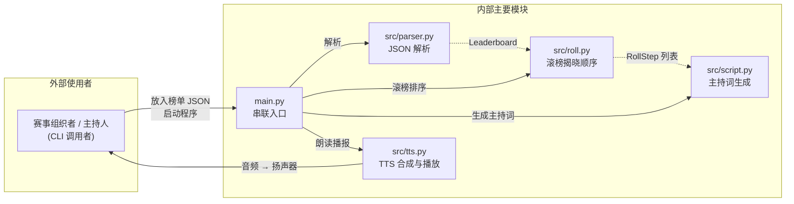

# 第 2 天实践报告：方案组成与技术选型

## 一、基本信息

| 栏目 | 内容 |
| --- | --- |
| 课题 | 算法竞赛 AI 智能主持人 |
| 成员 | 姚子秋（独立完成，1 人） |

## 二、今日目标

对应第 1 天定下的核心链路（排行榜 JSON → 数据解析 → 生成主持词 → TTS 语音 → 播放），今天确定"工作由哪几部分组成、每部分用什么、为什么这么选"，并跑通最小 demo，作为第 3~5 天实现的依据。

## 三、组成部分

系统外部只有一位使用者（赛事主持人/组织者），内部为 4 个模块 + 1 个入口，模块间为单向数据流，无循环依赖。

**模块依赖方向图：**

> 依赖方向 = 数据流向。外部使用者只与 main.py 入口交互；内部模块间为单向调用、无反向依赖。具体每一步调用的接口见下方职责表。

本项目重心在「主持人说话」（`script` + `tts`），解析与滚榜只做必要的数据准备：

| 模块 | 输入 | 输出 | 依赖（被谁调用 / 调用谁） | 负责 |
| --- | --- | --- | --- | --- |
| `main.py` | CLI 参数（`json_path`、`--roll`） | 语音播放 + 控制台打印 | 被：用户 / 调用：parser、roll、script、tts | 串联「解析 → 滚榜 → 主持词 → 播报」全流程，处理命令行与错误码 |
| `src/parser.py` | JSON 文本（字符串） | `Leaderboard`（含 `teams`） | 被：main / 调用：标准库 `json` | 把排行榜文件解析成结构化对象；只做最基础字段读取，队伍上限 5 |
| `src/roll.py` | `List[Team]` | `List<RollStep>`（每步：揭晓队伍 + 当前榜单） | 被：main / 调用：无第三方依赖 | 按"过题数降序、罚时升序"给出倒序揭晓顺序；每步重排一次 |
| `src/script.py` | `Leaderboard`（+ 可选 `List<RollStep>`） | 纯文本 `str`（适合 TTS） | 被：main / 调用：内部 `_num_to_cn` 数字转中文 | 按"开场 → 逐队揭晓 → 结果 → 颁奖 → 结束"顺序拼中文主持词；普通 / 滚榜两套入口 |
| `src/tts.py` | 中文 `str` | 音频播放（系统 SAPI5） | 被：main / 调用：`pyttsx3` | 选择系统中文音色 + 设置语速音量 + `say/runAndWait` 播放 |

## 四、与需求的对应

| 第 1 天必做项 | 对应模块 | 状态 |
| --- | --- | --- |
| 读取排行榜 JSON 数据 | `parser.py` | 已对应 |
| 解析排名与队伍信息 | `parser.py` | 已对应 |
| 按滚榜顺序生成中文主持词 | `roll.py`（前置算法）+ `script.py`（文案） | `roll` 已就绪，`script` 待第 3 天 |
| 将主持词转为语音（TTS） | `tts.py` | 选型确定，第 4 天接入 |
| 播放语音 | `tts.py` | 第 4 天接入 |
| 全链路贯通与演示 | `main.py` | 第 5 天目标 |

**处理办法说明：**
- 「按滚榜顺序生成主持词」这一条拆成两段承担：`roll.py` 只负责"从最后一名到第一名的揭晓顺序"，`script.py` 负责"中文文案"的生成。
- 「不做」清单里的 Web 界面、数据库、多人联机、账号、计分，均无对应模块，属预期内的"无人承担"，即明确不做，故不安排模块。

**需求 → 模块 → 演示路径对照：**

| 第 1 天核心需求 | 负责模块 | 第 5 天是否演示该路径 |
| --- | --- | --- |
| 导入榜单 JSON | `parser.py` | 是（放入样例 JSON，解析出队伍） |
| 按滚榜顺序生成主持词 | `roll.py` + `script.py` | 是（倒序逐队揭晓 + 中文文案） |
| TTS 语音播放 | `tts.py` | 是（扬声器同步朗读） |
| 本地一键启动 | `main.py` | 是（`python main.py` 跑通全链路） |

## 五、技术选型

**1. 语言与解析方式**

- **方案 A：Python 标准库 `json`（入选）**
  - 入选理由：零第三方依赖，符合课内"离线、无外部包"的交付边界；榜单格式多变可用字段别名 + 默认值容错。
  - 放弃理由：无（唯一备选是引入第三方解析库，无必要）。
- **方案 B：`pandas.read_json`（放弃）**
  - 放弃理由：引入重依赖 `pandas`，仅为解析一个榜单文件得不偿失，且与"依赖最小化"原则冲突。

**2. TTS 语音合成**

- **方案 A：`pyttsx3`（入选，主方案）**
  - 入选理由：离线、免费，Windows 下走系统 SAPI5，免 API Key、无配额限制，直接"合成 + 播放"一体，开发链路最短。
  - 放弃理由：无（作为主方案不放弃）。
- **方案 B：`edge-tts`（备选，按需启用）**
  - 入选理由（作为备选）：音质更自然，可在系统缺少中文语音包时兜底。
  - 放弃理由（作为默认）：需联网、有调用配额，不满足"离线交付边界"，故不作为默认。

## 六、今日完成与自检

**今天已确定的结论：**
- 方案组成：4 模块 + 1 入口，单向数据流，无循环依赖。
- 重心定位：本项目核心是"主持人说话"（`script` 主持词 + `tts` 语音），解析与滚榜只做必要的数据准备。
- 技术选型：JSON 用标准库、TTS 用 `pyttsx3`（备选 `edge-tts`）、测试用 `unittest`。
- 最小 demo 全部跑通：`parser` 解析出队伍列表、`roll` 给出正确的倒序揭晓顺序、`script` 输出关键句、`tts` 检测到中文语音。

**尚未确定的选型 / 边界：**
- 滚榜节奏（每队间停顿时长）是否做成可调参数，尚未定。
- 滚榜规则未完善：目前只给出揭晓顺序，封榜期间的提交解冻、罚时重算等细节尚未实现，待后续补充。

## 七、问题、计划与 AI 沟通

**不成功的沟通：**

- 第一次提问我直接说"帮我设计一个算法竞赛 AI 主持人系统"。助手回复了一张含 Web 前端、数据库、账号登录、实时联机的大而全架构图，多数功能超出 9 天工期，也和"单机命令行读榜播报"的实际需求对不上，无法直接采用。
- 处理办法：我把范围收窄为"只做单机命令行工具，读排行榜 JSON → 生成中文主持词 → 离线 TTS 播放，其余一律不做"，并附上第 1 天的必做/不做清单，让助手逐条对应。收窄后得到的组成说明才可直接采用。

**比较有效的沟通：**

- 把三条约束同时写进提问：① 必做项要逐条对应到模块；② 技术选型至少比较两种方案，并写清入选理由和放弃理由，不要只列技术名词；③ 正文标题固定为"基本信息 / 今日目标 / 组成部分 / 与需求的对应 / 技术选型 / 今日完成与自检 / 问题、计划与 AI 沟通"七个章节。据此得到的组成说明与选型比较无需二次裁剪。

**明日安排（第 3 天）：**
- 完成 `src/script.py`（普通模式 + 滚榜模式）并补充 `tests/test_script.py`。
- 约定 `parser` / `roll` / `script` 之间的数据接口，跑通 `parser → roll → script` 的纯文本链路（暂不接 TTS）。
- 写明榜单 JSON 样例的字段含义（`contest.name` / `contest.round` / `teams[].rank` / `name` / `solved` / `penalty` 各自代表什么、类型与必填/选填），落实课题"字段含义写进报告"的要求。
