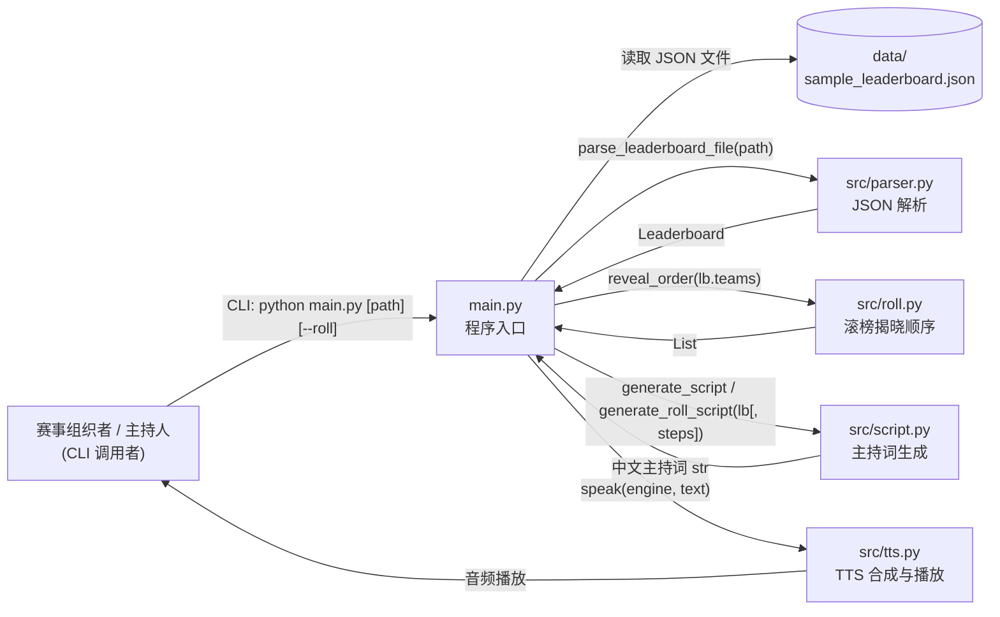

# 模块图与模块职责表（实践报告 02 配套）

> 配套 day02 报告"02.组成与技术选型"。本图只画主路径上的外部使用者、主要模块、依赖方向；配合下方的模块职责表，让"谁负责、做什么、依赖谁"一目了然。

## 一、模块图（主路径）

> 依赖方向 = 数据流向。所有模块间为单向调用，无反向依赖。

## 二、模块职责表

| 模块 | 名称 | 输入 | 输出 | 依赖（被谁调用 / 调用谁） | 负责 |
| --- | --- | --- | --- | --- | --- |
| `main.py` | 程序入口 | CLI 参数（`json_path`, `--roll`） | 语音播放 + 控制台打印 | 被：用户 / 调用：parser、roll、script、tts | 串联「解析 → 滚榜 → 主持词 → 播报」全流程，处理命令行与错误码 |
| `src/parser.py` | 排行榜 JSON 解析 | JSON 文本（字符串） | `Leaderboard`（含 `teams`） | 被：main / 调用：标准库 `json` | 把排行榜文件解析成结构化对象；只做最基础字段读取，队伍上限 5 |
| `src/roll.py` | 滚榜揭晓顺序 | `List[Team]`（duck-type `TeamState`） | `List<RollStep>`（每步：揭晓队伍 + 当前榜单） | 被：main / 调用：无第三方依赖 | 按"过题数降序、罚时升序"给出倒序揭晓顺序；每步重排一次 |
| `src/script.py` | 主持词生成 | `Leaderboard`（+ 可选 `List<RollStep>`） | 纯文本 `str`（适合 TTS） | 被：main / 调用：内部 `_num_to_cn` 数字转中文；类型上引用 `roll.RollStep` | 按"开场 → 逐队揭晓 → 结果 → 颁奖 → 结束"顺序拼中文主持词；普通 / 滚榜两套入口 |
| `src/tts.py` | TTS 合成与播放 | 中文 `str` | 音频播放（系统 SAPI5） | 被：main / 调用：`pyttsx3` | 选择系统中文音色 + 设置语速音量 + `say/runAndWait` 播放 |
